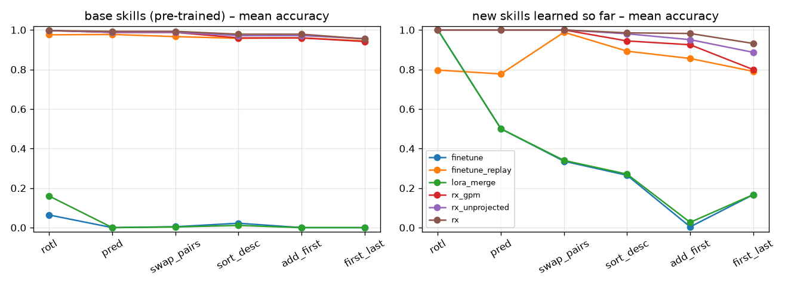

# Recursion-X

**A looped, liquid-hybrid, mixture-of-experts transformer that learns new
skills while awake and bakes them into its weights while one of its two
hemispheres sleeps.**

Recursion-X is a research prototype of a continually learning language-model
architecture.  It combines:

* **a Liquid-style hybrid backbone.**  Gated short convolutions with a liquid
  time-constant recurrence are interleaved with GQA attention (LFM2, LTC/CfC).
* **recursive / looped depth.**  A weight-tied core is iterated `R` times with
  input re-injection (Huginn, Ouro, universal transformers).  More loops can
  be spent at test time, and inference can stop early once the state
  converges.
* **Titans / MIRAS neural long-term memory.**  A matrix memory trained *at test
  time*, one gradient step per chunk, with momentum ("surprise") and a
  forget gate.  The attentional bias is configurable (`l2 | huber | l1`).
* **Engram-style hashed n-gram lookup tables.**  They depend only on token ids,
  so they can live in RAM or on disk (`numpy.memmap`) and be updated one row at
  a time.
* **a fluid mixture of experts.**  Shared + routed SwiGLU experts that can
  **grow** new experts during sleep and be **offloaded** to disk with LRU
  paging.
* **projected-LoRA skills.**  Each new skill is a LoRA adapter whose input is
  projected away from the subspace that consolidated knowledge occupies.  The
  adapter's `A` matrix is initialised from the new skill's own activation PCA,
  so the data is baked into the adapter before training starts.
* **dual-hemisphere wake/sleep consolidation**, as in dolphins, which sleep with
  one hemisphere at a time.  The *awake* hemisphere serves requests and learns
  adapters.  When enough skills pass the quality gate, the *sleeping*
  hemisphere syncs to the awake base and distils the skills into its own base
  weights: multi-teacher distillation with episodic replay and self-generated
  "dreams", gradient projection, then subspace protection.  The hemispheres
  then swap and the old one is reset.  Consolidation can run in a background
  thread while the awake side keeps serving.

See **[docs/DESIGN.md](docs/DESIGN.md)** for the full design and for where
each idea lives in the code.

```
recursionx/
  model.py                 prelude → looped core (weight-tied) → coda
  modules/liquid.py        LFM2-style gated conv + liquid time-constant scan
  modules/attention.py     GQA + RoPE + QK-norm
  modules/moe.py           Fluid MoE: shared/routed experts, growth, disk offload
  modules/neural_memory.py Titans/MIRAS test-time-trained memory
  modules/engram.py        hashed n-gram tables (memory or disk), sparse updates
  modules/lora.py          AdaptableLinear, projected LoRA, GPM subspaces
  lifecycle/wake.py        skill → projected LoRA, fact → Engram rows
  lifecycle/gate.py        "good enough to bake?"
  lifecycle/sleep.py       merge / REM distillation / dreams / growth / protect
  lifecycle/brain.py       DualHemisphereBrain: serve, learn, sleep, swap
  lifecycle/skills.py      skill records + learned skill router
experiments/               pretraining, continual benchmark, ablations
results/                   JSON results, plots, logs from the runs below
tests/                     unit + lifecycle tests
```

## Quick start

```bash
pip install -e .[dev]
pytest -q                                   # 16 tests, ~1 min on CPU

cd experiments
python pretrain_base.py --steps 3000        # base model on 6 base skills (~17 min CPU)
python continual.py --methods finetune,finetune_replay,lora_merge,rx,rx_unprojected
python report.py --plot
```

```python
from recursionx import RXConfig, RecursionX, LifecycleConfig, DualHemisphereBrain, SkillRecord

brain = DualHemisphereBrain(RecursionX(RXConfig()), LifecycleConfig())
brain.register_base_skills([...])            # what the pre-trained base knows (+ protect it)
brain.ingest(SkillRecord("new_skill", task), val_set)   # wake: learn, gate, serve via router
brain.sleep(background=True)                 # consolidate on the other hemisphere
logits = brain.logits(tokens)                # keeps serving meanwhile
brain.wake_up()                              # swap hemispheres
```

## Experiments

Everything here was run on a 4-core CPU with no GPU.  The model is therefore
tiny: 1.9 M backbone parameters plus a 0.5 M-parameter Engram table.  The
tasks are a synthetic *skill suite*: sequences are
`[BOS, TASK_k, x…, SEP, f_k(x)…, EOS]` over 16 symbols.  The task token is the
"instruction", and exact match counts every output token.  This is a
controlled test of **continual skill acquisition and forgetting**.  It is not
a claim about language-model quality at scale.

### Setup

* **Base model:** pre-trained 3,000 steps on six base skills (`copy, reverse,
  succ, sort, max, interleave`).  It reaches 0.98–1.00 exact match on each.
* **Continual phase:** six new skills arrive one at a time (`rotl, pred,
  swap_pairs, sort_desc, add_first, first_last`).  Every method gets the same
  600-step × 64-example learning budget per skill.  After each skill, all 12
  skills are evaluated through whatever the method would serve.
* **Recursion-X:** projected-LoRA wake learning, then the gate, then a sleep
  after every 2 accepted skills.  Sleep is 600 REM steps: multi-teacher
  distillation, 16 rehearsal examples per old skill per step (half stored
  episodes, half dreams), and GPM.  The episodic buffer is 64 examples per
  skill, the same buffer the replay baseline gets.

### Main result: 6 new skills learned sequentially

RESULTS_TABLE

*avg_all*: final mean accuracy over all 12 skills.  *learn_acc*: accuracy on
each new skill right after learning it.  *base_forgetting*: mean drop on the 6
pre-trained skills.  *bwt_new*: backward transfer on new skills (final minus
just-learned).



Takeaways:

1. **Naive fine-tuning and merging LoRAs as you go are catastrophic.**  They
   end knowing only the last skill (0.08 average; base skills 0.00).
2. **The wake/sleep lifecycle works.**  While awake, Recursion-X has **zero
   interference**: new skills are served through their adapters by a learned
   router, and base skills stay at 0.98–1.00.  After each sleep the skills
   live in the base weights with no adapters left.  Of the tested variants,
   the best reaches **REPLACE_BEST** average accuracy with base forgetting of
   REPLACE_FORGET.  Fine-tuning with replay, the standard strong baseline,
   reaches 0.868.
3. **How to consolidate matters more than anything else.**  See the
   sleep-variant study below.
4. **Honest negative result: at this scale the "projection" does not help.**
   See below.

### Sleep-variant study (what makes consolidation work)

The same two freshly learned adapters (`rotl`, `pred`) were consolidated in
different ways (`experiments/sleep_variants.py`,
`results/sleep_variants/results.json`):

| sleep variant | worst old skill | rotl | pred |
|---|---|---|---|
| merge adapters only (no REM) | 0.00 | 0.00 | 0.00 |
| merge → REM 300 | 0.40 (interleave) | 0.89 | 1.00 |
| no merge → REM 300 | 0.93 | 0.41 | 1.00 |
| merge → REM 300, per-skill balanced rehearsal | 0.67 | 0.92 | 1.00 |
| no merge → REM 300, balanced | 0.93 | 0.64 | 1.00 |
| **no merge → REM 600, balanced** (default) | **0.93** | **1.00** | **1.00** |

(Awake hemisphere before sleep: old skills 0.98–1.00, rotl 0.68, pred 1.00.)

* **Merging even *projected* adapters directly into the base is destructive.**
  Two merged adapters destroyed each other *and* the base.  The merge-preview
  gate shows why: a single always-on adapter, which is mathematically the same
  as merging it, drops old skills by ~0.99.
* **Distilling into the intact base works best.**  Start from the pre-sleep
  base, then learn from each skill's adapter teacher plus balanced
  rehearsal (stored episodes + dreams).  The student even beat its teacher
  (rotl 0.68 → 1.00), because REM also sees ground-truth episodes.

### Why the projection did not help here (and what that teaches)

Projected LoRA constrains the adapter to input directions that consolidated
knowledge does not use.  In this suite, a new skill is *a different function
of the same inputs*: rotl reads the same symbols and positions as copy.  The
only thing that separates skills is the instruction context.  Measured:

* At the default GPM threshold (0.97), only ~6–18 of 128 input dimensions per
  layer are protected, since a few dominant directions carry most of the
  energy.  The adapter's response to *old* inputs is as large as its response
  to new ones, so the projection protects little.
* Raising the threshold to 0.9999 protects 59% of the space and keeps old
  skills perfectly intact.  But the adapter can then no longer learn rotl
  (0.03).  This is the stability–plasticity trade-off in its purest form.
* Gradient projection during REM protects more as skills pile up.  By the
  third sleep it blocked `add_first` from consolidating (0.36).  The
  unprojected variant reached 0.88 on the same skill.

Separation between skills has to come from **context-conditional capacity**,
not input-space orthogonality.  In Recursion-X that means (a) the router,
awake, and (b) distillation with rehearsal, asleep.  The architectural version
of the same idea is **expert growth**: fresh experts the router sends only the
new skill's tokens to.  Growth is implemented (`grow_experts=True`) but not yet
benchmarked.  At scale, where layers are thousands of dimensions wide and
skills really do occupy different subspaces, projection may behave very
differently.  That has to be tested there.

REPLACE_EXTRA

## Status and roadmap

What exists and is tested:

* every architectural component, including causality tests, scan
  correctness, disk offload of experts and Engram rows, and Titans state
  carry-over across segments;
* the full wake → gate → sleep → swap lifecycle, including background sleep
  while serving;
* a continual-learning benchmark with baselines, ablations and results.

Next steps, roughly in order of expected value:

1. **Multiple seeds and longer skill streams**, with more sleep cycles, to
   measure how rehearsal cost and forgetting scale over many cycles.
2. **Benchmark expert growth** as the structural answer to "same inputs,
   different function".  Also try routing-conditioned adapters: a LoRA
   gated by the router, which can then be baked as a new expert rather than a
   dense merge.
3. **Hypernetwork "projector"** that generates a LoRA directly from a
   skill's documentation or examples (Text-to-LoRA style).  That would let the
   wake phase produce a first adapter in one forward pass, then refine it.
4. **Real research loop**: replace the task oracle with a tool-using agent
   that searches, reads and writes its own training episodes, and let the
   gate verify skills against held-out checks.
5. **Scale up**: a real tokenizer and text data, a GPU, a ~100 M → 1 B →
   4 B-parameter progression, KV cache / incremental decoding, deep MLP
   Titans memory, and a large disk-resident Engram store.
